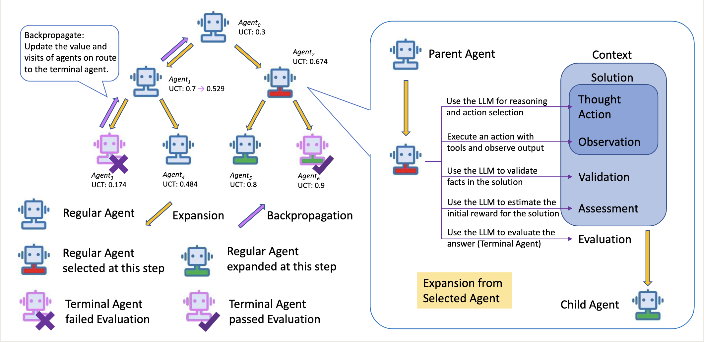

# 技术栈
- 微软 Agent-Framework

# MASTER [MASTER: A Multi-Agent System with LLM Specialized MCTS] 综述

Figure 1: Reasoning Tree of MASTER. Starting from Agent0, Agent1 and Agent2 are created in the first expansion. Then the system first selects Agent1 for expansion due to its higher UCT. Its child agent Agent3 is a terminal agent that failed evaluation which triggers a backpropagation and lowers the UCT of Agent1. Now Agent2 has the highest UCT and is selected for next expansion. Its child agent, Agent6 is a terminal agent and passes evaluation. The answer in it is the final answer.

# MASTER 原理

## What is MCTS?
MCTS (Coulom, 2006) is a widely used planning algorithm and famously employed in AlphaGo (Silver et al., 2016). Taking the Game of Go as an example, the algorithm assists in selecting the best possible action in the current state of the board based on their average rewards.

- 例如，考虑选择动作 a1 作为当前状态(state)的下一个动作。然后游戏继续进行，所有后续行动，无论是我们这边还是对手，都由策略模型而不是真正的玩家决定。
- 整个游戏序列构成动作 a1 的一个模拟 【Simulation】。
- 对于每局游戏来说，如果我们赢了，奖励是 1;否则，奖励为 0。
- 具体来说，如果我们从当前状态的下一动作 a1 开始， 模拟 10 场比赛并赢得其中的 9 场，则 a1 的平均奖励将为 0.9。
- 然而，由于围棋游戏中的动作空间广阔，模拟每一个可能的动作是不切实际的。
- 应用于树结构的上置信界1（UCT）算法能够识别出更具获胜潜力的行动，并将更多模拟资源分配给这些行动，而非在所有行动间平均分配模拟资源。
- 一旦通过该过程确定了一个动作并实际执行，从而进入新的棋局状态，接下来便会对这个新状态应用相同的流程来选择动作，如此反复规划，直至围棋游戏实际结束。

## MCTS 的4个阶段
- 选择（Selection）
遍历当前的推理树，在推理树中选择 UCT 分数最高的子节点， 将该子节点作为模拟 (Simulation)

- 扩展（Expansion）
将上一步选中的 UCT 分数最高的节点的子节点全部加入到推理树中， 达到扩展推理树的目的。

- 模拟（Simulation）
从上一步新加入推理树中的子节点开始，继续扩展推理树，直到整个任务完成。

- 回传（Backpropagation）
在每次模拟（Simulation）之后，使用新获取的模拟奖励 （Simulation reward） 来更新推理树中所有相关节点的平均奖励（Average Reward）。

## MASTER 框架
### 主要创新点
MASTER 框架结合了三种特殊的机制来获得奖励：在自我评估（self-evaluation）—之前提供更多 context，在一个新颖的 UCT 公式中合并了大模型的置信度，以及，使用这种 UCT 公式来更新反向传播中的奖励。

## MASTER 主要流程

### 1. 任务初始化与核心生成（Thought+Action）
- 框架接收任务后，会以该问题初始化一个 root agent。
- agent调用LLM生成两部分内容：反映当前推理轨迹的Thought，以及解决问题的Action提议。
- 此环节LLM温度设为0.6，目的是提升推理树中想法和行动的多样性。

---

### 2. 行动执行与Solution构成
- agent通过与外部环境交互的工具执行Action，产生反馈结果Observation。
- Thought、Action、Observation三类文本共同构成agent的Solution（如图1所示）。

---

### 3. 验证（Validation）与评估（Assessment）
- 后续agent调用LLM生成Validation文本，用于核验当前Solution中的关键事实（fact）。
- 基于Solution和Validation，LLM进一步生成Assessment，包含问题解决进度的分数（score）及模型对该分数的置信度（confidence）。
- 这两个环节LLM温度设为0.0，以保障决策的稳定性，最终提取分数（score）和置信度（confidence）两个数值。

---

### 4. 上下文存储与初始奖励
- Solution、Validation、Assessment三类文本整合为agent的Context，存储于其记忆中（如图1所示）。
- 此前提取的分数将作为agent的初始奖励。

### 5. 子agent的生成与扩展逻辑
子agent的创建以根agent为基础，遵循与根agent完全一致的生成流程，核心差异在于提示词设计——根agent的Context会被附加到子agent的提示词中，确保子agent能承接前文任务进度，持续推进问题解决。
- 生成目的：从同一父agent状态出发，通过多个子agent探索多样化的推理路径（如图1中Agent1与Agent2，二者使用完全相同的流程和提示词）。
- 关键超参数：子agent的数量由超参数“Number of Branches（分支数）”控制，该参数需根据具体任务特性灵活调整。
- 扩展定义：由父agent生成子agent的过程被称为“Expansion（扩展）”，系统支持从任意已存在的agent出发，按相同规则进行进一步扩展。

### 6. 推理树扩展的核心规则
- 扩展agent选择标准：系统会计算每个agent的UCT值（Upper Confidence Bound for Trees，树的上置信界），选择UCT值最高的agent进行下一步扩展，以平衡探索与利用效率。
- 扩展终止控制：超参数“Maximum of Expansion（最大扩展步数）”用于定义解决问题所需的近似步骤数，用户可基于对任务的理解设定。若达到该步数仍未找到满意解，系统将选取“终端agent（Terminal Agents）”中奖励最高的解作为最终答案提交。

### 7. Terminal agent的定义与识别
Terminal agent是推理树扩展中特殊的agent类型，其核心特征是在Solution中生成“最终答案”而非“中间步骤”，具体识别依赖任务专属的动作标识：
- 通用定义：当agent的Solution包含最终答案时，即被判定为终端agent，区别于仅输出推理中间环节的普通agent。
- 实例说明：在HotpotQA任务中，若agent的Action为“Finish[]”，则表明其输出为最终答案，直接被识别为终端agent；其他任务的Solution中也存在类似的终端标识。

### 8. terminal agent的评估与任务闭环机制
“Evaluation（评估）”环节仅适用于 terminal agent，是决定任务走向的关键节点，具体流程与结果处理如下：
1. 正确性评估：LLM会对终端agent的Solution进行正确性判定。
2. 任务终止条件：若评估判定Solution正确，该答案将直接作为最终结果提交，任务结束。
3. 错误处理与反向传播：若评估判定Solution错误，则触发“Backpropagation（反向传播）”机制——以该终端agent的奖励为依据，更新从该终端agent回溯至根agent的路径上所有agent的奖励，实现奖励的动态优化。

## 修改后的 UCT 公式

### 原始的 UCT 公式推导
推导MCTS（蒙特卡洛树搜索）中的核心公式 **UCT（Upper Confidence Bound for Trees）**，需从其理论基础 **Hoeffding不等式** 出发，结合“利用（Exploitation）-探索（Exploration）”的平衡目标，逐步推导。

### 一、核心前提与定义
#### 1. 问题背景
MCTS的「选择阶段」需要从当前节点的所有子节点中，选择一个“最有潜力”的节点继续搜索。潜力的衡量需平衡两点：
- **利用（Exploitation）**：选择已观测到的平均收益高的节点（依赖过往经验）；
- **探索（Exploration）**：选择访问次数少、不确定性高的节点（避免错过最优解）。

UCT公式的本质是为每个节点计算一个「上置信界（Upper Confidence Bound, UCB）」，用“观测收益 + 不确定性惩罚”量化节点潜力，最终选择UCB最大的节点。

#### 2. 关键定义
- 设节点的**奖励随机变量**为 $r$，满足 $r \in [0,1]$（简化假设，实际可扩展到其他有界区间）；
- 对某节点，共访问 $n_i$ 次，观测到的奖励序列为 $r_1, r_2, ..., r_{n_i}$（独立同分布）；
- **样本均值（观测平均收益，利用项）**：$Q_i = \frac{1}{n_i} \sum_{k=1}^{n_i} r_k$（已知，由过往访问数据计算）；
- **真实期望（未知真实收益）**：$q_i = \mathbb{E}[r]$（未知，是我们需要估计的核心量）；
- 父节点总访问次数 $N$（或原文中的 $N_i$）：用于衡量当前节点的“探索优先级”（父节点访问越多，子节点的探索不确定性需适当降低）。

#### 3. 理论基础：Hoeffding不等式
Hoeffding不等式描述了「有界独立随机变量的样本均值与真实期望的偏差概率上界」，是UCT推导的核心工具。其原始形式（对应原文公式9）为：  
对于有界随机变量 $r_k \in [a_k, b_k]$（独立同分布），对任意 $\varepsilon > 0$，有：  
$$
P\left( \frac{1}{n_i} \sum_{k=1}^{n_i} (r_k - \mathbb{E}[r_k]) \geq \varepsilon \right) \leq \exp\left( -\frac{2 n_i^2 \varepsilon^2}{\sum_{k=1}^{n_i} (b_k - a_k)^2} \right) \tag{9}
$$

**核心含义**：样本均值与真实期望的差值超过 $\varepsilon$ 的概率，被一个指数函数上界限制（偏差越大，概率越小）。

### 二、公式简化与置信区间推导
#### 步骤1：简化Hoeffding不等式（利用奖励有界性）
由于假设 $r_k \in [0,1]$（奖励在0到1之间），则对所有 $k$，$b_k - a_k = 1$，因此分母 $\sum_{k=1}^{n_i} (b_k - a_k)^2 = n_i$。  
代入公式（9），不等式简化为：  
$$
P\left( Q_i - q_i \geq \varepsilon \right) \leq \exp\left( -2 n_i \varepsilon^2 \right) \tag{11}
$$

**解释**：样本均值 $Q_i$ 比真实期望 $q_i$ 大 $\varepsilon$ 以上的概率，不超过 $\exp(-2 n_i \varepsilon^2)$（访问次数 $n_i$ 越多，这个概率越小，即样本均值越接近真实期望）。

#### 步骤2：对称性扩展（双向偏差）
同理，“样本均值比真实期望小 $\varepsilon$ 以上”的概率，由对称性可得：  
$$
P\left( Q_i - q_i \leq -\varepsilon \right) \leq \exp\left( -2 n_i \varepsilon^2 \right) \tag{12}
$$

结合（11）和（12），可得到「样本均值与真实期望的偏差不超过 $\varepsilon$」的概率下界：  
$$
P\left( |Q_i - q_i| \leq \varepsilon \right) \geq 1 - 2 \exp\left( -2 n_i \varepsilon^2 \right) \tag{13}
$$

**核心含义**：我们有至少 $1 - 2 \exp(-2 n_i \varepsilon^2)$ 的置信度，认为真实期望 $q_i$ 落在区间 $[Q_i - \varepsilon, Q_i + \varepsilon]$ 内（这个区间称为「置信区间」）。

#### 步骤3：解出不确定性项 $\varepsilon$
为了将“置信度”转化为具体的 $\varepsilon$（不确定性惩罚项），我们设定一个置信水平：令 $\exp(-2 n_i \varepsilon^2) = \frac{1}{N}$（其中 $N$ 是父节点总访问次数，用于关联全局探索程度），即：  
$$
N = \exp\left( 2 n_i \varepsilon^2 \right)
$$

对两边取自然对数，解出 $\varepsilon$：  
$$
\ln(N) = 2 n_i \varepsilon^2 \implies \varepsilon = \sqrt{\frac{\ln(N)}{2 n_i}} \tag{14}
$$

**解释**：$\varepsilon$ 是置信区间的半宽，反映了样本均值的不确定性：
- 子节点访问次数 $n_i$ 越小，$\varepsilon$ 越大（不确定性越高，探索权重越大）；
- 父节点访问次数 $N$ 越大，$\varepsilon$ 越大（全局探索越充分，子节点的探索优先级适当提高）。

#### 步骤4：推导UCT公式（上置信界）
UCT的核心是用「置信区间的上界」估计真实期望 $q_i$（因为我们要选择“潜力最大”的节点，需考虑不确定性带来的最坏情况上限）。  

由置信区间 $q_i \in [Q_i - \varepsilon, Q_i + \varepsilon]$，真实期望 $q_i$ 的上置信界为：  
$$
q_i \leq Q_i + \varepsilon
$$

代入步骤3中 $\varepsilon$ 的表达式，最终得到 **UCT公式**：  
$$
\text{UCT}(i) = Q_i + \sqrt{\frac{\ln(N)}{2 n_i}} \tag{16}
$$

### 三、关键补充与标准形式
#### 1. 探索常数 $C$
原文推导的是基础版本，标准UCT公式（UCB1变体）会引入一个**探索常数 $C$**（通常取 $C = \sqrt{2}$），用于调节探索的强度：  
$$
\text{UCT}(i) = Q_i + C \cdot \sqrt{\frac{\ln(N)}{2 n_i}}
$$
- $C$ 越大，探索权重越高（更倾向于访问少的节点）；
- $C$ 越小，利用权重越高（更倾向于访问多、收益高的节点）。

#### 2. 逻辑链条总结
Hoeffding不等式（有界随机变量偏差上界）→ 简化不等式（奖励∈[0,1]）→ 定义样本均值/真实期望 → 推导置信区间 → 解不确定性项ε → 上置信界（UCT公式）。  

核心目标：通过“观测收益（利用）+ 不确定性惩罚（探索）”，在MCTS选择阶段平衡两者，避免过早收敛到局部最优解。

### 最终UCT公式（标准形式）
$$
\boxed{\text{UCT}(i) = \underbrace{Q_i}_{\text{利用项（观测平均收益）}} + \underbrace{C \cdot \sqrt{\frac{\ln(N)}{2 n_i}}}_{\text{探索项（不确定性惩罚）}}}
$$
- $Q_i$：节点 $i$ 的平均收益（已观测，利用过往经验）；
- $N$：父节点的总访问次数（全局探索程度）；
- $n_i$：节点 $i$ 自身的访问次数（局部探索程度）；
- $C$：探索常数（调节利用/探索的权重）。
