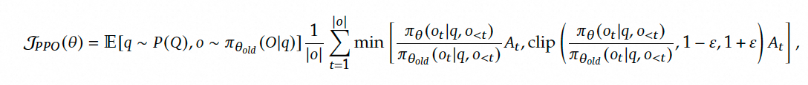

---

好的，我来一步一步详细解释PPO（Proximal Policy Optimization）的原理，尽量用通俗的语言和具体公式说明。

---

### **第一步：强化学习基础回顾**
在强化学习中，智能体通过**策略π(a|s)**（给定状态s选择动作a的概率）与环境交互，目标是最大化**累计奖励期望值**。策略梯度方法直接优化策略参数θ，通过梯度上升更新θ：

$$
J(θ) = \mathbb{E}_{s,a \sim π_θ} [R(s,a)] \\
θ_{new} = θ_{old} + α \nabla_θ J(θ)
$$

但传统策略梯度存在**样本效率低**和**训练不稳定**的问题（一次更新可能彻底破坏策略性能）。

---

### **第二步：PPO的核心思想**
PPO通过**限制策略更新的幅度**来解决不稳定性问题，核心是：
1. **重要性采样（Importance Sampling）**：用旧策略π_old的数据估计新策略π_new的期望
2. **裁剪（Clipping）**：强制新策略与旧策略的差异不超过阈值

---

### **第三步：关键公式推导**

#### **1. 策略更新的目标函数**
原始策略梯度目标函数是最大化期望奖励：

$$
J(θ) = \mathbb{E}_{t} \left[ \frac{π_θ(a_t|s_t)}{π_{old}(a_t|s_t)} A_t \right]
$$

其中：
- $\frac{π_θ}{π_{old}}$ 是**重要性权重**（新旧策略概率的比值）
- $A_t$ 是**优势函数**（当前动作比平均动作好多少）

#### **2. 引入裁剪机制**
为了防止重要性权重过大，PPO对目标函数进行裁剪：

$$
J^{CLIP}(θ) = \mathbb{E}_{t} \left[ \min \left( r_t(θ) A_t, \text{clip}(r_t(θ), 1-ε, 1+ε) A_t \right) \right]
$$

其中：
- $r_t(θ) = \frac{π_θ(a_t|s_t)}{π_{old}(a_t|s_t)}$（重要性权重）
- $ε$ 是超参数（通常取0.1~0.3）
- $\text{clip}(x, a, b)$ 将x限制在[a,b]之间

**裁剪的作用**：当$r_t$偏离1超过ε时，目标函数取较小的值，阻止过大的策略更新。

---

### **第四步：完整PPO算法流程**
1. **收集数据**：用当前策略π_old与环境交互，存储轨迹数据
2. **计算优势值**：用Critic网络估计优势函数$A_t$（例如通过TD误差或GAE）
3. **优化目标函数**：通过梯度上升最大化以下组合目标：

$$
J^{PPO}(θ) = \mathbb{E}_t \left[ J^{CLIP}(θ) - c_1 J^{VF}(θ) + c_2 S[π_θ](s_t) \right]
$$

其中：
- $J^{VF}(θ)$：价值函数误差（Critic的均方误差）
- $S$：策略熵（鼓励探索）
- $c_1, c_2$：超参数权重

---

### **第五步：PPO的两种实现形式**
#### **1. PPO-Clip（主流方法）**
直接使用上述裁剪目标函数，无需计算KL散度。

#### **2. PPO-Penalty**
通过KL散度约束策略更新幅度：

$$
J^{KLPEN}(θ) = \mathbb{E}_t \left[ \frac{π_θ}{π_{old}} A_t - β \cdot KL(π_{old} \| π_θ) \right]
$$

其中β动态调整（KL大则增大β，KL小则减小β）

---

### **第六步：关键设计优势**
1. **样本复用**：同一批数据可多次用于更新（传统PG只能一次）
2. **数值稳定**：裁剪机制防止梯度爆炸
3. **兼容性**：可结合GAE（Generalized Advantage Estimation）高效估计优势函数

---

### **第七步：核心公式总结**
| 组件 | 公式 |
|------|------|
| 重要性权重 | $r_t(θ) = \frac{π_θ(a_t\|s_t)}{π_{old}(a_t\|s_t)}$ |
| 裁剪目标 | $\min(r_t A_t, \text{clip}(r_t,1-ε,1+ε) A_t)$ |
| 价值函数误差 | $J^{VF} = (V_θ(s_t) - V_{target})^2$ |
| 熵正则项 | $S = -\sum π_θ(a\|s) \log π_θ(a\|s)$ |

---

### **第八步：通俗比喻**
想象教机器人走路：
1. **传统PG**：每次让机器人尝试新步态，可能直接摔跤（更新幅度过大）
2. **PPO**：用绳子拴住机器人，只允许它在一定范围内改变动作（裁剪机制），同时反复观察旧录像学习（重要性采样）

这种设计让PPO成为目前最主流的强化学习算法之一（如ChatGPT的微调阶段就使用了PPO）。
